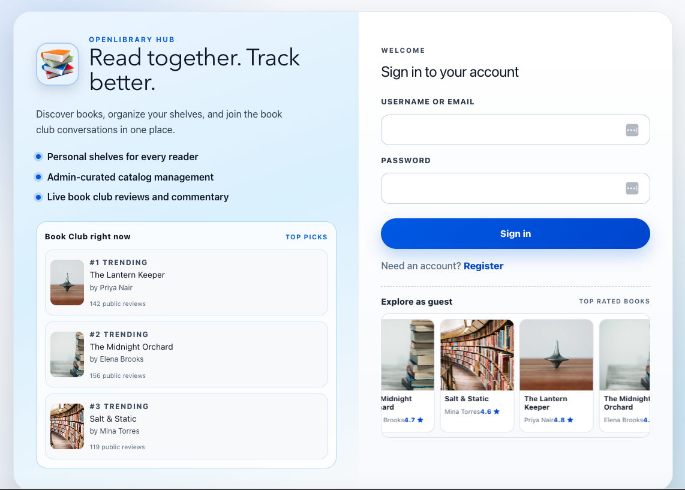
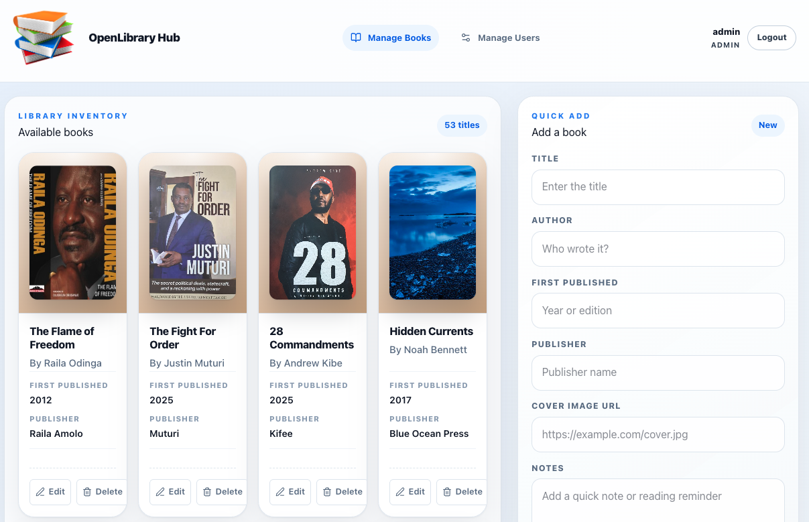
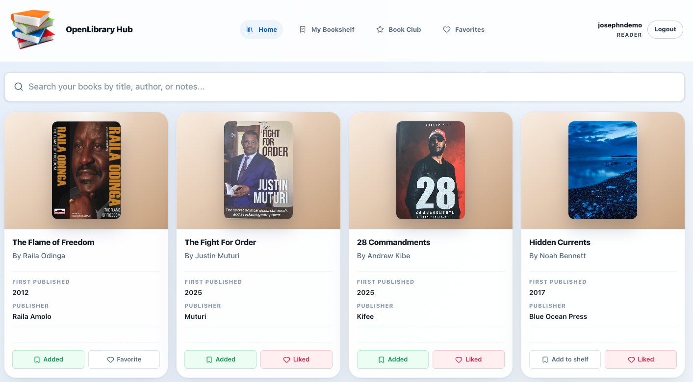
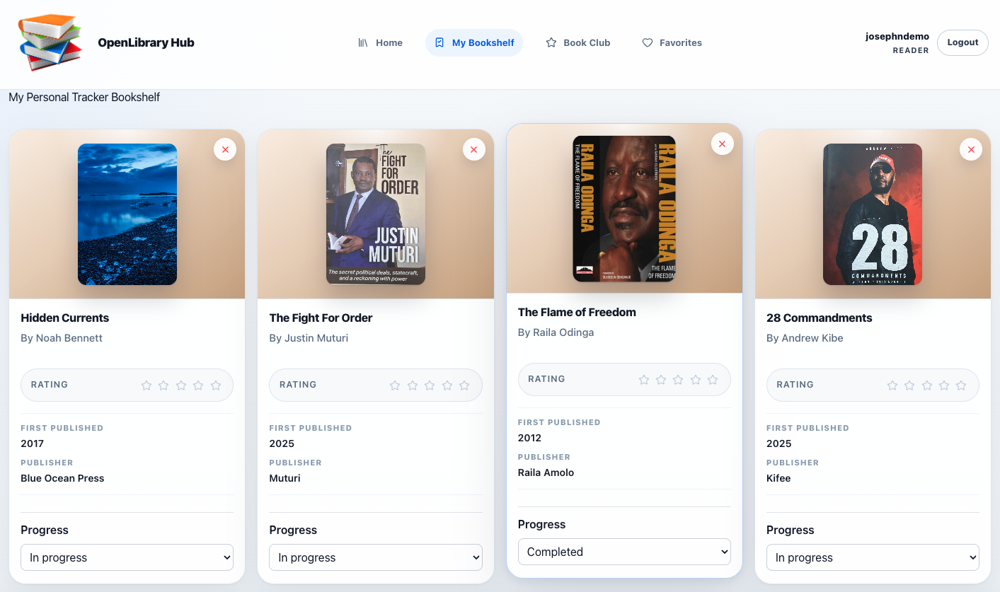
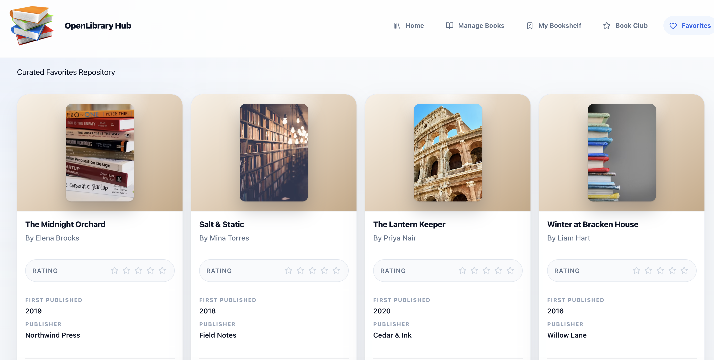
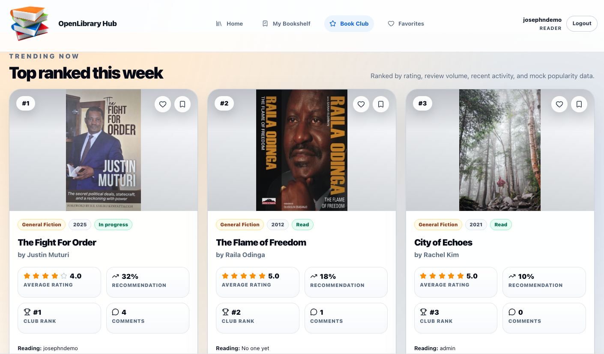
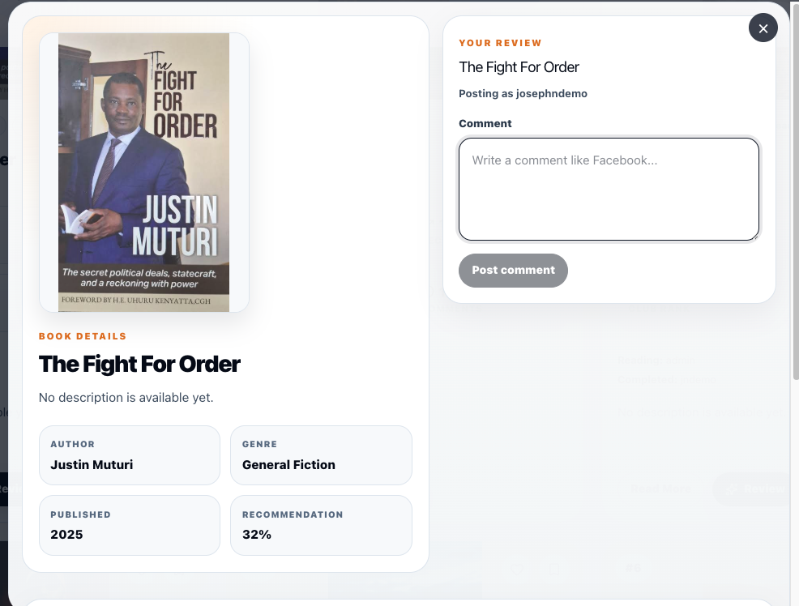

# OpenLibrary Hub

A full-stack book discovery and tracking application with a React frontend and Flask backend.

OpenLibrary Hub enables readers to search millions of books, manage personalized reading lists, save favorites, rate books, and maintain reading notes through a modern user interface backed by a persistent API.

---

## Overview

OpenLibrary Hub was developed as a Software Engineering Capstone Project with a focus on:

* Frontend performance optimization
* Modern React architecture
* Responsive user experience
* State management best practices
* API integration and asynchronous programming
* API integration and asynchronous programming
* Component-based software design
* Client-side routing with React Router
* Dynamic data fetching and rendering
* Search, filtering, and data organization

The application integrates with the Open Library REST API to provide access to one of the world's largest collections of bibliographic records.

---
## Deployed Application link

https://openlibrary20.vercel.app/

### Backend

https://group1project1.onrender.com

---

## Full-Stack Architecture

### Frontend

- React + Vite SPA
- Handles UI rendering, state management, and API calls

### Backend

- Flask REST API
- Handles authentication, shelves, books, and reviews
- Persists data with SQLAlchemy models

## Application Preview

> Add screenshots of your application here.

### Login Page


### Admin Page



### Home Page



### Bookshelf Tracker



### Favorites




### Book Club



### Reviews & Notes



---

## Features

### Real-Time Book Search

* Search books by title, author, or keyword
* Integrated Open Library API
* Debounced search requests (600ms delay)
* Loading and error state handling

### Personal Bookshelf Tracker

* Save books to a personal reading collection
* Track reading progress
* Update status:

  * Want to Read
  * In Progress
  * Completed

### Favorites Management

* Add or remove favorite books
* Dedicated favorites view
* Instant state synchronization

### Ratings & Reviews

* Rate books using a star-rating system
* Automatically organize rated books
* Sort reviews by highest rating

### Reading Notes

* Add personal reflections and notes
* Timestamped entries
* Unique identifiers generated using `crypto.randomUUID()`

### Modern Notifications

* SweetAlert2 toast notifications
* Non-blocking user feedback
* Improved user experience

### Persistent Storage

* Browser localStorage integration
* Automatic data persistence
* State recovery on page refresh

---

## Authentication

OpenLibrary Hub uses JWT-based authentication with `flask-jwt-extended`.

### Auth Endpoints

* `POST /auth/register` - create a new user account
* `POST /auth/login` - authenticate and receive an `access_token`
* `GET /auth/me` - get the authenticated user profile

### Register (Signup)

Request:

```json
{
  "username": "newreader",
  "email": "newreader@example.com",
  "password": "welcome123"
}
```

Response:

```json
{
  "message": "user registered"
}
```

### Login

Request:

```json
{
  "identifier": "newreader@example.com",
  "password": "welcome123"
}
```

Response:

```json
{
  "access_token": "<jwt-token>",
  "user": {
    "id": 12,
    "username": "newreader",
    "email": "newreader@example.com",
    "role": "user"
  }
}
```

### Using the Token

Send the JWT in the `Authorization` header:

```http
Authorization: Bearer <jwt-token>
```

This is required for protected routes such as:

* `GET /shelves`
* `GET /favorites`
* `GET /books`
* `POST /reviews`

### Default Demo Accounts

If default-user sync is enabled in backend startup, these credentials are available:

* `demo@example.com` / `demo123`
* `admin@example.com` / `admin123`
* `joseph.ndemo@example.com` / `password123`
* `mark.warunge@example.com` / `password123`
* `gregory.kipchumba@example.com` / `password123`
* `abdirahman.abdisalah@example.com` / `password123`
* `robert.maina@example.com` / `password123`
* `rotich.ian@example.com` / `password123`

---

## Technology Stack

| Category      | Technology            |
| ------------- | --------------------- |
| Frontend      | React 19              |
| Backend       | Flask                 |
| ORM           | SQLAlchemy            |
| Auth          | JWT (flask-jwt-extended) |
| Build Tool    | Vite                  |
| Styling       | Tailwind CSS v4       |
| Icons         | Lucide React          |
| Notifications | SweetAlert2           |
| API           | Open Library REST API |
| Storage       | Browser localStorage  |

---

## Project Structure

```text
Group1Project1/
├── back-end/
│   ├── app.py
│   ├── models.py
│   ├── reviews_routes.py
│   ├── schemas.py
│   ├── config.py
│   ├── Pipfile
│   └── README.md
├── front-end/
│   ├── src/
│   │   ├── components/
│   │   ├── features/
│   │   ├── api/
│   │   ├── App.jsx
│   │   └── main.jsx
│   ├── package.json
│   └── vite.config.js
└── README.md
```

## Backend Structure

```text
back-end/
├── app.py                # Flask app entrypoint and route registration
├── config.py             # App and database configuration
├── models.py             # SQLAlchemy models (User, Shelf, Book, Review)
├── schemas.py            # Marshmallow serialization schemas
├── reviews_routes.py     # Review and book-club recommendation routes
├── seed.py               # Seed script for initial/demo data
├── requirements.txt      # pip dependencies
├── Pipfile               # pipenv dependency definition
├── Pipfile.lock          # locked pipenv dependency versions
├── .env.example          # environment variable template
└── instance/             # local Flask instance/runtime data
```

### Backend Layers

* Entry Layer: `app.py` initializes Flask, CORS, JWT, and blueprints.
* Data Layer: `models.py` defines database entities and relationships.
* Serialization Layer: `schemas.py` controls request/response data shapes.
* Route Layer: `app.py` and `reviews_routes.py` expose REST endpoints.

## Getting Started

### Prerequisites

Before running the project, ensure you have:

* Python 3.12+
* pipenv
* Node.js 20.19+ or 22.12+
* npm (included with Node.js)
* PostgreSQL

---

### 1. Clone the Repository

```bash
git clone https://github.com/josephndemo/Group1Project1.git

cd Group1Project1
```

### 2. Configure and Run Backend

```bash
cd back-end
pip install pipenv
pipenv install
cp .env.example .env
createdb library_db
pipenv run python app.py
```

Backend runs at:

```text
http://127.0.0.1:5001
```

### 3. Configure and Run Frontend

```bash
cd ../front-end
npm install
npm run dev
```

Frontend runs at:

```text
http://127.0.0.1:5173
```

### 4. Optional Frontend API Override

If you need to override the default API URL:

```bash
VITE_API_BASE_URL=http://127.0.0.1:5001
```

### 5. Open in Browser

Visit:

```text
http://localhost:5173
```

---

## Backend API Overview

### Health

* `GET /health`

### Auth

* `POST /auth/register`
* `POST /auth/login`

### Shelves

* `GET /shelves`
* `POST /shelves`
* `GET /shelves/<id>`
* `PUT /shelves/<id>`
* `DELETE /shelves/<id>`

### Books

* `GET /books`
* `POST /books`
* `GET /books/<id>`
* `PUT /books/<id>`
* `DELETE /books/<id>`

### Reviews

* `GET /reviews`
* `POST /reviews`
* `GET /reviews/<id>`
* `PUT /reviews/<id>`
* `DELETE /reviews/<id>`
* `GET /books/<id>/reviews`

### Book Club

* `GET /book-club/recommendations`

---

## Core Engineering Concepts

### Search Debouncing

To reduce unnecessary API calls, search requests are delayed until the user stops typing.

```javascript
useEffect(() => {
  const timer = setTimeout(() => {
    setDebouncedTerm(searchTerm);
    setPage(1);
  }, 600);

  return () => clearTimeout(timer);
}, [searchTerm]);
```

### Local Storage Persistence

Application state is automatically synchronized with browser storage.

```javascript
useEffect(() => {
  localStorage.setItem(
    "bookshelf",
    JSON.stringify(bookshelf)
  );
}, [bookshelf]);
```

### Tailwind CSS v4 + Vite Integration

```javascript
import { defineConfig } from "vite";
import react from "@vitejs/plugin-react";
import tailwindcss from "@tailwindcss/vite";

export default defineConfig({
  plugins: [
    react(),
    tailwindcss(),
  ],
});
```

---

## Key Learning Outcomes

Through this project, I gained practical experience in:

* React component architecture
* State management using Hooks
* REST API integration
* Asynchronous JavaScript
* Performance optimization
* Tailwind CSS v4 workflow
* User-centered design principles
* Modern build tooling with Vite

---

## Future Roadmap

### Phase 2

* PostgreSQL database
* RESTful API services

### Phase 3

* JWT authentication
* User accounts and profiles
* Cloud deployment

### Future Enhancements

* Reading analytics dashboard
* Monthly reading statistics
* Personalized recommendations
* Community discussions
* Social sharing features

---

# React + Vite

This template provides a minimal setup to get React working in Vite with HMR and some ESLint rules.

Currently, two official plugins are available:

- [@vitejs/plugin-react](https://github.com/vitejs/vite-plugin-react/blob/main/packages/plugin-react) uses [Oxc](https://oxc.rs)
- [@vitejs/plugin-react-swc](https://github.com/vitejs/vite-plugin-react/blob/main/packages/plugin-react-swc) uses [SWC](https://swc.rs/)

## React Compiler

The React Compiler is not enabled on this template because of its impact on dev & build performances. To add it, see [this documentation](https://react.dev/learn/react-compiler/installation).

## Developer

1.Joseph Ndemo
2.Mark Warunge
3.Gregory Kipchumba
4.Abdirahman Abdi Salah
5.Robert Maina
6.Rotich Ian
